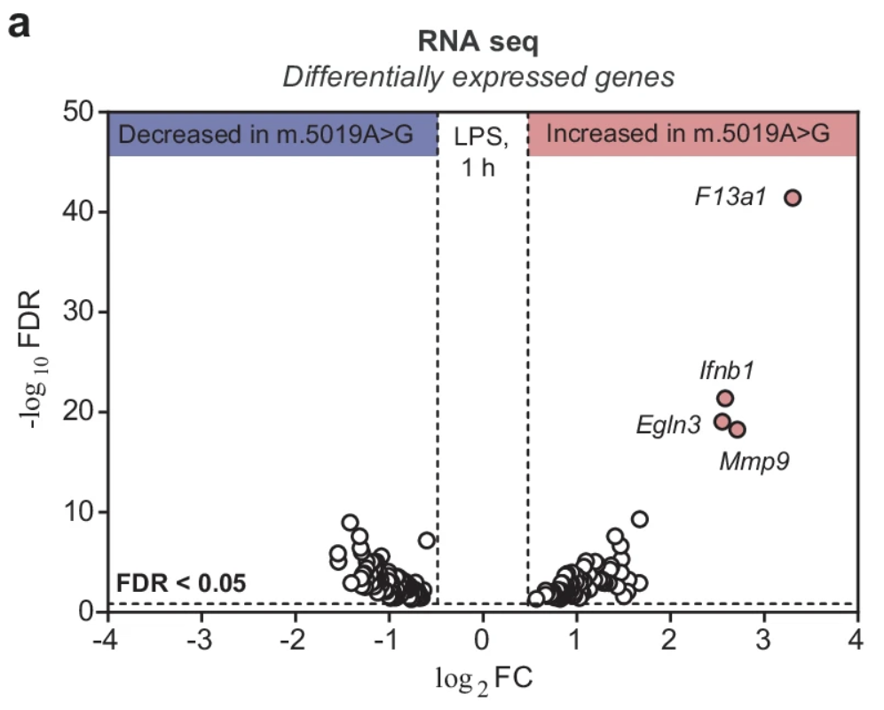
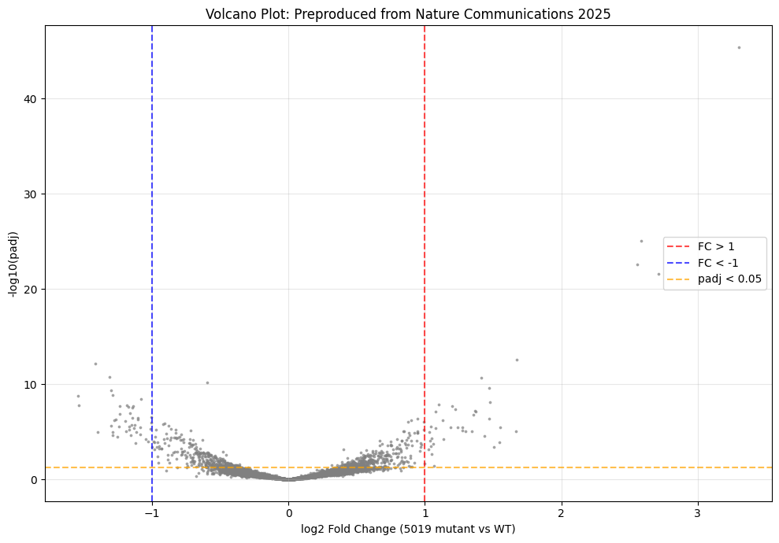

# Mitochondria-Macrophage RNA-seq Reproduction

Reproducing RNA-seq analysis from **Nature Communications November 2025** on mtDNA mutant macrophages using public Dryad data.

[Marques, E., Burr, S.P., Casey, A.M. et al. An inherited mitochondrial DNA mutation remodels inflammatory cytokine responses in macrophages and in vivo in mice. Nat Commun 16, 10222 (2025)](https://www.nature.com/articles/s41467-025-65023-4#data-availability)

## Paper context (Nature Communications 2025)

This paper investigates mitochondrial heteroplasmy in mammalian macrophages, showing reduced respiratory chain function vs. controls. Here I highlight data from their LPS-stimulated RNA-seq experiment by **reproducing the volcano plot** using SQL/Python on the public Dryad dataset. Key finding: **Ifnb1** (type I interferon) strongly upregulated in mtDNA mutants vs. WT.

**Original figure**: Paper Figure 5A 

**My reproduction**:

[Live notebook](notebooks/01_rnaseq_reproduction.ipynb)
